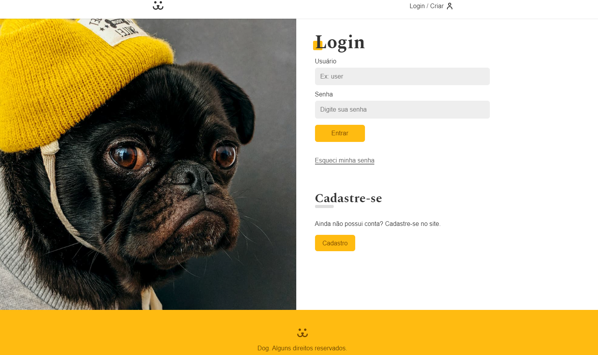
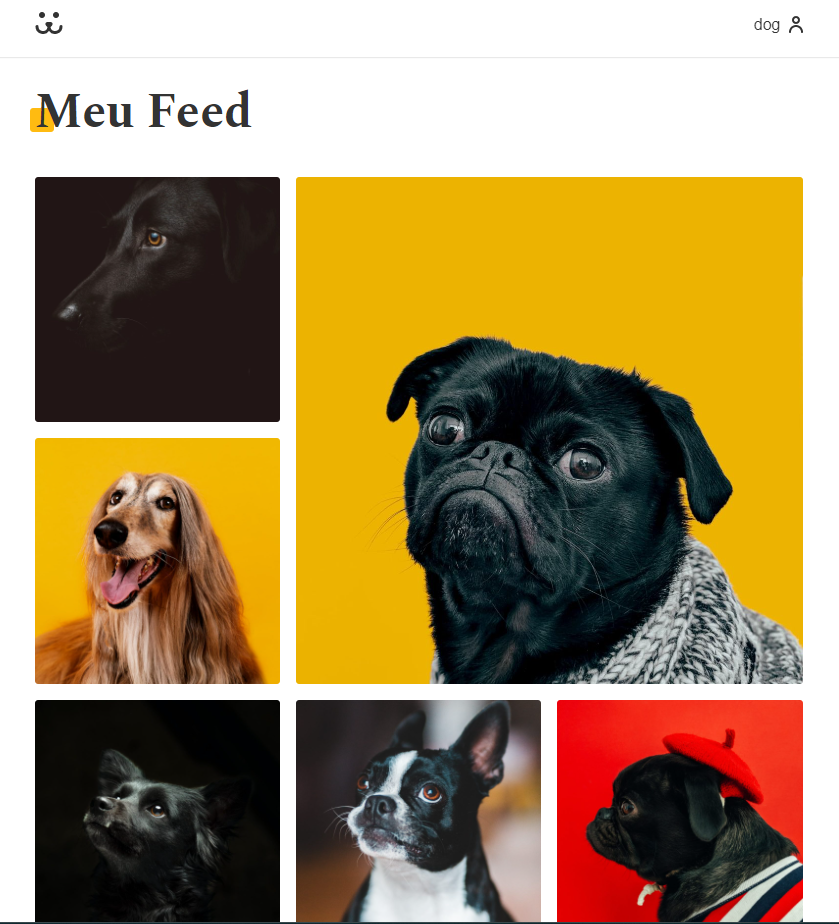

# Dogs 🚀🚀🚀

Este é o projeto "Dogs" desenvolvido durante o programa de React da Origamid. Ele é uma aplicação web para compartilhamento de fotos de cachorros. Os usuários podem se cadastrar, fazer login, postar fotos, visualizar e interagir com as fotos de outros usuários.

O projeto foi construído utilizando a biblioteca React, juntamente com outras tecnologias como React Router e Victory (graphs). A estrutura do projeto é gerenciada pelo Vite, um bundler de desenvolvimento rápido.

## Link do projeto na Netlify
<a href="https://photo-dogs.netlify.app/">https://photo-dogs.netlify.app/</a>

## Preview



## Funcionalidades

- Autenticação de usuário: os usuários podem se cadastrar e fazer login para acessar as funcionalidades do sistema.
- Postagem de fotos: os usuários autenticados podem postar suas próprias fotos de cachorros para compartilhar com outros usuários.
- Feed de fotos: os usuários podem navegar pelo feed de fotos para visualizar e interagir com as fotos compartilhadas pelos outros usuários.
- Interatividade: os usuários podem curtir e comentar nas fotos, além de seguir outros usuários para receber atualizações de suas postagens.

## Requisitos

Certifique-se de ter o Node.js instalado em sua máquina antes de começar.

## Instalação 🔧

1. Clone este repositório em sua máquina local.
2. Navegue até o diretório do projeto no terminal.
3. Execute o seguinte comando para instalar as dependências:

```
npm install
```

## Scripts disponíveis ⚙️

No diretório do projeto, você pode executar os seguintes comandos:

### `npm run dev`

Executa o aplicativo em modo de desenvolvimento. Abra [http://localhost:3000](http://localhost:3000) no navegador para visualizá-lo.

### `npm run build`

Compila o aplicativo para produção na pasta `dist`. Ele agrupa corretamente o React no modo de produção e otimiza a construção para o melhor desempenho.

## Dependências

Este projeto utiliza as seguintes dependências:

- prop-types: ^15.8.1
- react: ^18.2.0
- react-dom: ^18.2.0
- react-router-dom: ^6.11.2
- victory: ^36.6.10
- vite-plugin-svgr: ^3.2.0

## Dependências de desenvolvimento

Este projeto utiliza as seguintes dependências de desenvolvimento:

- @types/react: ^18.0.28
- @types/react-dom: ^18.0.11
- @vitejs/plugin-react: ^4.0.0
- eslint: ^8.38.0
- eslint-plugin-react: ^7.32.2
- eslint-plugin-react-hooks: ^4.6.0
- eslint-plugin-react-refresh: ^0.3.4
- vite: ^4.3.2

## Construído com


## Contatos
<a href="mailto: tamurafelipe@gmail.com"></a>
<a href="https://www.linkedin.com/in/felipe-diego-tamura/"></a>